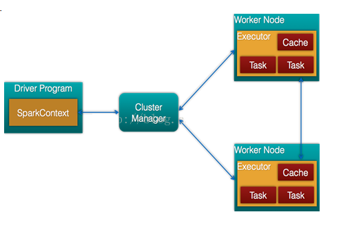

# **SPARK LEARNING**

## 一、Spark架构

如图：



- Cluster Manager：在standalone模式中即为Master主节点，控制整个集群，监控worker。在YARN模式中为资源管理器。

- Worker节点：从节点，负责控制计算节点，启动Executor或者Driver。

- Driver： 运行Application 的main()函数

- Executor：执行器，是为某个Application运行在worker node上的一个进程

## 二、运行流程

如图：


+ 1、构建Spark Application运行环境，启动SparkContext。
+ 2、SparkContext向资源管理器申请Executor资源，并启动StandaloneExecutorbackend。
+ 3、Executor向SparkContext申请Task。
+ 4、SparkContext将应用分发给Executor
+ 5、SparkContext构建DAG图，分解成Stage，将Taskset发送到TaskScheduler,最后由TaskScheduler，将Task发送给Executor运行
+ 6、Executor运行Task，然后释放资源

## 三、Spark 的任务层次

+ job：由动作算子作为分界线，将整个任务分成多个job。

+ stage:每个job由多个stage组成，一个job以宽窄依赖作为分界，即shuffle作为分界分成多个stage.

+ task:多个task组成一个stage。一个task表示被送到Executor上的工作单元。

如图：


## 四、Spark 运行模式

### 1、Standalone模式：

使用spark自带资源调度框架，采用Master/Slaves的典型架构，选用ZooKeeper来实现Master的HA。

### 2、本地模式

### 3、对外部资源调度框架的支持

这里重点讲spark on yarn.

​	1、Yarn-Client模式：Driver在客户端本地运行，这种模式可以使得Spark Application和客户端进行交互，因为Driver在客户端，所以可以通过webUI访问Driver的状态

​	2、YARN-Cluster模式：当用户向YARN中提交一个应用程序后，YARN将分两个阶段运行该应用程序：

+ 1. 第一个阶段是把Spark的Driver作为一个ApplicationMaster在YARN集群中先启动；
+ 2. 第二个阶段是由ApplicationMaster创建应用程序，然后为它向ResourceManager申请资源，并启动Executor来运行Task，同时监控它的整个运行过程，直到运行完成。

Spark Client 和 Spark Cluster的区别:

- 理解YARN-Client和YARN-Cluster深层次的区别之前先清楚一个概念：Application Master。在YARN中，每个Application实例都有一个ApplicationMaster进程，它是Application启动的第一个容器。它负责和ResourceManager打交道并请求资源，获取资源之后告诉NodeManager为其启动Container。从深层次的含义讲YARN-Cluster和YARN-Client模式的区别其实就是ApplicationMaster进程的区别

- YARN-Cluster模式下，Driver运行在AM(Application Master)中，它负责向YARN申请资源，并监督作业的运行状况。当用户提交了作业之后，就可以关掉Client，作业会继续在YARN上运行，因而YARN-Cluster模式不适合运行交互类型的作业

- YARN-Client模式下，Application Master仅仅向YARN请求Executor，Client会和请求的Container通信来调度他们工作，也就是说Client不能离开

## 五、Spark算子操作及比较

### 1、reduceBykey、aggregateByKey、groupbykey的区别和运用场景

官方文档（spark2.1.1）：

|func|note|
| ---------------------------------------------------- | ------------------------------------------------------------ |
| groupByKey([numTasks])                               | When called on a dataset of (K, V) pairs, returns a dataset of (K, Iterable<V>) pairs.  当对（K，V）对的数据集进行调用时，返回（K，Iterable <V>）对的数据集。Note: If you are grouping in order to perform an aggregation (such as a sum or average) over each key, using reduceByKey or aggregateByKey will yield much better performance. 如果要分组以便在每个键上执行聚合（如总和或平均值），则使用reduceByKey或aggregateByKey将会产生更好的性能。 Note: By default, the level of parallelism in the output depends on the number of partitions of the parent RDD. You can pass an optional numTasks argument to set a different number of tasks.默认情况下，输出中的并行级别取决于父RDD的分区数。您可以传递一个可选的numTasks参数来设置不同数量的任务。 |
| reduceByKey(func, [numTasks])                        | When called on a dataset of (K, V) pairs, returns a dataset of (K, V) pairs where the values for each key are aggregated using the given reduce function func, which must be of type (V,V) => V. Like in groupByKey, the number of reduce tasks is configurable through an optional second argument. 其中每个密钥的值使用给定的reduce函数func进行聚合，该函数必须是类型（V，V）=> V。与groupByKey类似，reduce任务的数量可以通过可选的第二个参数进行配置。 |
| aggregateByKey(zeroValue)(seqOp, combOp, [numTasks]) | When called on a dataset of (K, V) pairs, returns a dataset of (K, U) pairs where the values for each key are aggregated using the given combine functions and a neutral "zero" value. Allows an aggregated value type that is different than the input value type, while avoiding unnecessary allocations. Like in groupByKey, the number of reduce tasks is configurable through an optional second argument. 其中每个键的值使用给定的组合函数和中性“零”值进行聚合。允许不同于输入值类型的聚合值类型，同时避免不必要的分配。像groupByKey一样，reduce任务的数量可以通过可选的第二个参数进行配置。 |

 总结下来：

1、当需要将数据分类并且数据不多的情况下可以用groupbykey。

2、当需要对value计算并且返回类型与原始类型一致，则用reducebykey。

3、当需要将数据分类且需要高性能时，用aggregateByKey。

aggregateByKey和reducebykey都会在Executor本地先汇总一次再到一台机子上汇总，而groupbykey则直接到一台机子上汇总，这样大量消耗网络带宽，执行速度慢。

### 2、foreach和foreachPartition

foreach会在每个元素上执行操作。

foreachPartition会在每个partition上执行操作。

一般来说foreach够用，但如果操作中需要用重复创建一个对象，例如数据库连接，gson序列化实例，那么最好使用foreachPartition，使得一个executor上只有一个实例，避免重复创建对象消耗资源。

### 3、repartition and coalesce

两个都是重新分区。

先上源码

```scala
def coalesce(numPartitions: Int, shuffle: Boolean = false)(implicit ord: Ordering[T] = null)
    : RDD[T] = withScope {
  if (shuffle) {
    /** Distributes elements evenly across output partitions, starting from a random partition. */
    val distributePartition = (index: Int, items: Iterator[T]) => {
      var position = (new Random(index)).nextInt(numPartitions)
      items.map { t =>
        // Note that the hash code of the key will just be the key itself. The HashPartitioner
        // will mod it with the number of total partitions.
        position = position + 1
        (position, t)
      }
    } : Iterator[(Int, T)]
 
    // include a shuffle step so that our upstream tasks are still distributed
    new CoalescedRDD(
      new ShuffledRDD[Int, T, T](mapPartitionsWithIndex(distributePartition),
      new HashPartitioner(numPartitions)),
      numPartitions).values
  } else {
    new CoalescedRDD(this, numPartitions)
  }
}
```

```scala
def repartition(numPartitions: Int)(implicit ord: Ordering[T] = null): RDD[T] = withScope {
    coalesce(numPartitions, shuffle = true)
  }
```

可见repartition是shuffle=true时的coalesce。

但是shuffle为false时不会移动数据，单纯就是将数据块重新逻辑划分一下，而repartition会将所有数据重新shuffle。

当需要减少分区数时推荐使用coalesce，

当需要扩大分区数时，只能用repartition。

## 六、Spark优化

### 一、数据倾斜解决方案

#### 方案一：使用Hive ETL预处理数据

+ **适用场景**：数据来自hive表，而hive表中数据本身不均匀，而业务场景中需要频繁使用spark对hive表执行操作。
+ **方案思路**：此时可以评估一下，是否可以通过Hive来进行数据预处理（即通过Hive ETL预先对数据按照key进行聚合，或者是预先和其他表进行join），然后在Spark作业中针对的数据源就不是原来的Hive表了，而是预处理后的Hive表。此时由于数据已经预先进行过聚合或join操作了，那么在Spark作业中也就不需要使用原先的shuffle类算子执行这类操作了。
+ **方案实践经验：**在一些Java系统与Spark结合使用的项目中，会出现Java代码频繁调用Spark作业的场景，而且对Spark作业的执行性能要求很高，就比较适合使用这种方案。将数据倾斜提前到上游的Hive ETL，每天仅执行一次，只有那一次是比较慢的，而之后每次Java调用Spark作业时，执行速度都会很快，能够提供更好的用户体验。
+ **优点**：实现简单，提升spark作业性能
+ **缺点**：治标不治本，hiveETL中仍然会发生数据倾斜

#### 方案二：过滤少数导致倾斜的key

+ **适用场景**：发现导致倾斜的key就少数几个，而且对计算本身的影响并不大的话，那么很适合使用这种方案。比如99%的key就对应10条数据，但是只有一个key对应了100万数据，从而导致了数据倾斜。

+ **方案思路**：如果我们判断那少数几个数据量特别多的key，对作业的执行和计算结果不是特别重要的话，那么干脆就直接过滤掉那少数几个key。比如，在Spark SQL中可以使用where子句过滤掉这些key或者在Spark Core中对RDD执行filter算子过滤掉这些key。如果需要每次作业执行时，动态判定哪些key的数据量最多然后再进行过滤，那么可以使用sample算子对RDD进行采样，然后计算出每个key的数量，取数据量最多的key过滤掉即可。

+ **优点**：实现简单，而且效果也很好，可以完全规避掉数据倾斜。

+ **缺点**：适用场景不多，大多数情况下，导致倾斜的key还是很多的，并不是只有少数几个。

#### 方案三：提高shuffle操作并行度

+ **适用场景**：如果我们必须要对数据倾斜迎难而上，那么建议优先使用这种方案，因为这是处理数据倾斜最简单的一种方案。

+ **实现思路**：在对RDD执行shuffle算子时，给shuffle算子传入一个参数，比如reduceByKey(1000)，该参数就设置了这个shuffle算子执行时shuffle read task的数量。对于Spark SQL中的shuffle类语句，比如group by、join等，需要设置一个参数，即spark.sql.shuffle.partitions，该参数代表了shuffle read task的并行度，该值默认是200，对于很多场景来说都有点过小。

+ **优点**：实现简单，有效缓解数据倾斜的影响。

+ **缺点**：缓解数据倾斜，但没有彻底解决问题，效果有限。

#### 方案四：两阶段聚合（局部聚合+全局聚合）

+ **适用场景**：对RDD执行reduceByKey等聚合类shuffle算子或者在Spark SQL中使用group by语句进行分组聚合时，比较适用这种方案。

+ **实现思路**：核心是进行2阶段聚合。第一次是局部聚合，先给每个key打上随机数，比如10以内的随机数，此时原先一样的key就变成不一样的了，比如(hello, 1) (hello, 1) (hello, 1) (hello, 1)，就会变成(1_hello, 1) (1_hello, 1) (2_hello, 1) (2_hello, 1)。接着对打上随机数后的数据，执行reduceByKey等聚合操作，进行局部聚合，就会变成了(1_hello, 2) (2_hello, 2)。然后将各个key的前缀去掉，变成(hello,2)(hello,2)，再次进行全局聚合操作，得到最终结果。

+ **优点**：对于聚合类的shuffle操作导致的数据倾斜，效果是非常不错的。通常都可以解决掉数据倾斜，或者至少是大幅度缓解数据倾斜，将Spark作业的性能提升数倍以上。

+ **缺点**：仅仅适用于聚合类的shuffle操作，适用范围相对较窄。如果是join类的shuffle操作，还得用其他的解决方案。

#### 方案五：将reduce join转为map join

+ **适用场景**：在对RDD使用join类操作，或者是在Spark SQL中使用join语句时，而且join操作中的一个RDD或表的数据量比较小（比如几百M或者一两G），比较适用此方案。

+ **实现思路**：不使用join算子进行连接操作，而使用Broadcast变量与map类算子实现join操作，进而完全规避掉shuffle类的操作，彻底避免数据倾斜的发生和出现。将较小RDD中的数据直接通过collect算子拉取到Driver端的内存中来，然后对其创建一个Broadcast变量；接着对另外一个RDD执行map类算子，在算子函数内，从Broadcast变量中获取较小RDD的全量数据，与当前RDD的每一条数据按照连接key进行比对，如果连接key相同的话，那么就将两个RDD的数据用你需要的方式连接起来。

+ **优点**：对join操作导致的数据倾斜效果比较好，根本不会shuffle。

+ **缺点**：适用场景少，只适用一个大表和一个小表的情况。毕竟我们需要将小表进行广播，此时会比较消耗内存资源，driver和每个Executor内存中都会驻留一份小RDD的全量数据。如果我们广播出去的RDD数据比较大，比如10G以上，那么就可能发生内存溢出了。因此并不适合两个都是大表的情况。

#### 方案六：采样倾斜key并分拆join操作

+ **适用场景**：两个RDD/Hive表进行join的时候，如果数据量都比较大，无法采用“解决方案五”，那么此时可以看一下两个RDD/Hive表中的key分布情况。如果出现数据倾斜，是因为其中某一个RDD/Hive表中的少数几个key的数据量过大，而另一个RDD/Hive表中的所有key都分布比较均匀，那么采用这个解决方案是比较合适的。

+ **实现思路**：

  1. 对包含少数几个数据量过大的key的那个RDD，通过sample算子采样出一份样本来，然后统计一下每个key的数量，计算出来数据量最大的是哪几个key。

  2. 然后将这几个key对应的数据从原来的RDD中拆分出来，形成一个单独的RDD，并给每个key都打上n以内的随机数作为前缀，而不会导致倾斜的大部分key形成另外一个RDD。

  3. 接着将需要join的另一个RDD，也过滤出来那几个倾斜key对应的数据并形成一个单独的RDD，将每条数据膨胀成n条数据，这n条数据都按顺序附加一个0~n的前缀，不会导致倾斜的大部分key也形成另外一个RDD。

  4. 再将附加了随机前缀的独立RDD与另一个膨胀n倍的独立RDD进行join，此时就可以将原先相同的key打散成n份，分散到多个task中去进行join了。

  5. 而另外两个普通的RDD就照常join即可。

  6. 最后将两次join的结果使用union算子合并起来即可，就是最终的join结果。

+ **优点**：对于join导致的数据倾斜，如果只是某几个key导致了倾斜，采用该方式可以用最有效的方式打散key进行join。而且只需要针对少数倾斜key对应的数据进行扩容n倍，不需要对全量数据进行扩容。避免了占用过多内存。

+ **缺点**：如果导致倾斜的key特别多的话，比如成千上万个key都导致数据倾斜，那么这种方式也不适合。

#### 方案七：使用随机前缀和扩容RDD进行join

+ **适用场景**：进行join时，RDD中有大量key导致数据倾斜，拆分key没有意义，此时使用最后这个方案解决问题。

+ **实现思路**：

  1. 先查看RDD中数据分布情况，发现有多个key对应的数据量多。

  2. 将该RDD每条数据打上n以内的随机前缀。

  3. 对另一个正常RDD扩容，将每条数据扩容成n条数据，扩容出来的每条数据依次打上0~n的前缀。

  4. 最后将两个处理后的RDD进行join。

+ **优点**：对join类数据倾斜基本都可以处理，性能提升不少。

+ **缺点**：该方案更多的是缓解数据倾斜，而不是彻底避免数据倾斜。而且需要对整个RDD进行扩容，对内存资源要求很高。

### 二、资源分配调优

在生产环境中,提交spark作业时,使用spark-submit shell脚本,里面调整对应的参数 
常用参数

```shell
/opt/modules/spark-1.6.1-bin-2.5.0-cdh5.3.6/bin/spark-submit \
--class com.hypers.sparkproject.spark.session.UserVisitSessionAnalyzeSpark \
--num-executors 3 \                           --配置executor的数量
--driver-memory  1024M \                      --配置driver的内存,影响不大
--executor-memory 2G \                        --配置每个executor的内存大小
--executor-cores 3 \ --Spark standalone and YARN only --配置每个executor的cpu核数
/usr/loacl/recommend-1.0-SNAPSHOT.jar \
```

- 增加executor数量和executor的CPU核数 : 增加了并行执行能力,加入原来20个executor,每个executor的CPU核数为2个,那么能够并行执行的task数量就是40个task,当在资源允许的情况下增加这两个指标,执行速度将会成倍增加

- 增加executor的内存 : 增加内存后,对性能的提升主要有三点: 
  1. 如果要对RDD进行cache,那么更多的内存就可以缓存更多的数据,将更少的数据写入磁盘,甚至不写入磁盘,减少了磁盘IO
  
  2. 对于shuffle操作,在reduce端,会需要内存来存放拉取的数据并进行聚合,如果内存不足,也会写入磁盘,如果给executor分配更多的内存,同样减少磁盘IO
  
  3. 对于task的执行,可能会创建很多对象,如果内存较小,可能会频繁导致JVM堆内存满了,然后频繁GC,垃圾回收,minor GC和full GC,速度很慢
  
### 三、并行度调优

理想情况下,task数量设置成Spark Application 的总CPU核数,但是现实中总有一些task运行慢一些task快,导致快的先执行完,空余的cpu 核就浪费掉了,所以官方推荐task数量要设置成Spark Application的总cpu核数的2~3 倍。

```java
SparkConf conf = new SparkConf().set("spark.default.parallelism", "500")
```

### 四、重构RDD架构及RDD持久化 序列化

+ RDD架构重构与优化 
  默认情况下,多次对一个RDD执行算子,去获取不同的RDD,都会对这个RDD以及之前的父RDD全部重新计算一次,在实际项目中,一定要避免出现一个RDD重复计算的情况, 所以,要尽量去复用RDD,差不多的RDD可以抽取为一个共同的RDD,供后面的RDD计算时反复使用

+ 公共RDD实现持久化 
  对于要多次计算和使用的公共RDD,一定要进行持久化 
  持久化:也就是说,将RDD的数据缓存在内存中/磁盘中,(BlockManager),之后无论对这个RDD做多少次计算,都是直接取这个RDD的持久化的数据

+ 持久化数据序列化 
  如果正常将数据持久化在内存中,那么可能会导致内存的占用过大,会导致OOM,当纯内存无法支撑公共RDD数据完全存放的时候,就需要优先考虑使用序列化的方式在纯内存中存储,将RDD的每个partition的数据,序列化成一个大的字节数组,就一个对象,序列化后,大大减少内存的空间占用 
  序列化的唯一缺点就是在获取数据的时候需要反序列化, 如果序列化后纯内存的方式还导致OOM,就只能考虑内存+无序列化的普通方式

+ 持久化+双副本机制 
  为了数据的高可靠性，而且内存充足，可以使用双副本机制进行持久化 
  持久化的双副本机制，持久化后的一个副本，因为机器宕机了，副本丢了，就还是得重新计算一次；持久化的每个数据单元，存储一份副本，放在其他节点上面；从而进行容错；一个副本丢了，不用重新计算，还可以使用另外一份副本。

### 五、广播变量

广播变量:Broadcast,将大变量广播出去,而不是直接使用

+ 为什么要用Broadcast 
  当进行随机抽取一些操作,或者从某个表里读取一些维度的数据,比如所有商品品类的信息,在某个算子函数中要使用到,加入该数据大小为100M,那么1000个task将会消耗100G的内存, 集群损失不可估量
+ Broadcast的原理 
  默认的情况下,每个task执行的算子中,使用到了外部的变量,每个task都会获取一份变量的副本,所以会消耗很多的内存,进而导致RDD持久化内存不够等情况,大大影响执行速度 
  广播变量,在driver上会有一份初始的副本,task在运行的时候,如果要使用广播变量中的数据,首先会在自己本地的Executor对应的BlockManager中尝试获取变量副本,并保存在本地的BlockManager中,此后这个Executor上的所有task,都会直接使用本地的BlockManager中的副本,Executor的BlockManager除了从driver上拉取,也可能从其他节点的BlockManager上拉取变量副本,距离越近越好. 

总而言之: 广播变量的好处不是每一个task一份变量副本,而是变成每个节点的executor才一份副本,这样的话就可以变量产生的副本大大减少

### 六、Kryo序列化的使用

默认情况下,Spark内部是使用java的序列化机制ObjectInputStream/ObjectOutputStream,即对象输入输出流机制来进行序列化, 这种序列化机制的好处在于,处理起来比较方便,只需在在算子里面使用的变量,必须是实现Serializable接口的,可序列化即可,但是这种默认的序列化机制的效率不高,序列化速度慢,序列化以后的数据占用的内存空间相对很大 
Spark支持使用Kryo序列化机制,比默认的java序列化机制速度要快很多,而且序列化后的数据大小大概是java序列化机制的1/10 
Kryo序列化机制,一旦启用,会生效的几个地方

+ 算子函数中使用的外部变量 
算子函数中使用的外部变量,在经过kryo序列化之后,会优化网络传输的性能,优化集群中内存的占用和消耗

+ 持久化RDD时进行序列化,StorageLevel.MEMORY_ONLY_SER 
持久化RDD的时候,优化内存的占用和消耗

+ shuffle 
  优化网络传输的性能

第一步: 在SparkConf中设置一个属性

```java
SparkConf.set("spark.serializer", "org.apache.spark.serializer.KryoSerializer")
```

第二步: 注册需要使用Kryo序列化的自定义的类 
如果要达到Kryo的最佳性能的话,那么就一定要注册自定义的类

```java
SparkConf.set("spark.serializer", "org.apache.spark.serializer.KryoSerializer").registerKryoClasses(new Class[]{CategorySortKey.class})
```

## 参考：

+ [基本架构及原理](https://www.cnblogs.com/cxxjohnson/p/8909578.html)
+ [Spark中的groupByKey 、aggregateByKey、reduceByKey 的区别](https://blog.csdn.net/faan0966/article/details/80513260)
+ [Spark聚合操作-reduceByKey、groupByKey、combineBykey的使用与比较](https://www.cnblogs.com/LuisYao/p/6813228.html)
+ [Spark中foreachRDD、foreachPartition和foreach解读](https://blog.csdn.net/Scapel/article/details/84030362)
+  [Spark Rdd coalesce()方法和repartition()方法](https://www.cnblogs.com/fillPv/p/5392186.html)
+  [Spark性能优化指南——高级篇 ](https://blog.csdn.net/lukabruce/article/details/81504220)
+  [Spark开发性能调优](https://blog.csdn.net/vinfly_li/article/details/79415342)

