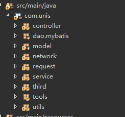

# **SSM框架**
## **1、事务配置失效**
applicationContext.xml配置如下：
```xml
<?xml version="1.0" encoding="UTF-8"?>
<beans xmlns="http://www.springframework.org/schema/beans"
       xmlns:xsi="http://www.w3.org/2001/XMLSchema-instance"
       xmlns:context="http://www.springframework.org/schema/context"
       xsi:schemaLocation="http://www.springframework.org/schema/beans
       http://www.springframework.org/schema/beans/spring-beans.xsd
       http://www.springframework.org/schema/context
       http://www.springframework.org/schema/context/spring-context.xsd
       "
        >
      <!--扫描-->
       <context:component-scan base-package="com.unis"/>
       <!--开启注解-->
       <context:annotation-config />
       <!-- 数据访问层配置 -->
       <import resource="classpath:/spring-comm-dao.xml" />
    <!--init-->
    <bean class="com.unis.service.InitListener"/>


</beans>
```
项目结构如下：




spring-comm-dao.xml配置如下：
```xml
<?xml version="1.0" encoding="UTF-8" ?>
<beans xmlns="http://www.springframework.org/schema/beans" default-lazy-init="true"
       xmlns:xsi="http://www.w3.org/2001/XMLSchema-instance"
       xmlns:p="http://www.springframework.org/schema/p"
       xmlns:context="http://www.springframework.org/schema/context"
       xmlns:aop="http://www.springframework.org/schema/aop"
       xmlns:tx="http://www.springframework.org/schema/tx"
       xsi:schemaLocation="http://www.springframework.org/schema/beans
       http://www.springframework.org/schema/beans/spring-beans.xsd
       http://www.springframework.org/schema/context
       http://www.springframework.org/schema/context/spring-context.xsd
       http://www.springframework.org/schema/tx
       http://www.springframework.org/schema/tx/spring-tx.xsd
       http://www.springframework.org/schema/aop
       http://www.springframework.org/schema/aop/spring-aop.xsd">
    <context:property-placeholder location= "classpath:mysql-jdbc.properties" />
    <bean id="dataSource" class="org.apache.commons.dbcp.BasicDataSource"
          destroy-method="close"
          p:driverClassName="${jdbc.driverClassName}"
          p:url="${jdbc.url}"
          p:username="${jdbc.username}"
          p:password="${jdbc.password}"
          p:maxActive="${jdbc.maxActive}"
          p:maxWait="${jdbc.maxWait}"
          p:maxIdle="${jdbc.maxIdle}"
          p:validationQuery="select 1"
          p:testOnBorrow="true"
          p:defaultAutoCommit="true"/>


    <!-- 配置Jdbc模板  -->
    <bean id="jdbcTemplate" class="org.springframework.jdbc.core.JdbcTemplate"
          p:dataSource-ref="dataSource" />

    <!-- myBatis文件 -->
    <bean id="sqlSessionFactory" class="org.mybatis.spring.SqlSessionFactoryBean">
        <property name="dataSource" ref="dataSource"/>
        <property name="configLocation" value="classpath:mybatis-mapper-config.xml"/>

    </bean>
    <bean class="org.mybatis.spring.mapper.MapperScannerConfigurer">
        <!-- 非常重要。。。
       在mybatis 中扫描,并且注解 Repository 在代码中才能使用 @Autowired Mapper 接口,在SPRING 中扫描没用-->
        <property name="basePackage" value="com.unis.dao.mybatis"/>
        <property name="annotationClass" value="org.springframework.stereotype.Repository"/>

    </bean>
    <!-- 使用SESSION 直接操作 -->
    <bean id="sqlSession" class="org.mybatis.spring.SqlSessionTemplate">
        <constructor-arg index="0" ref="sqlSessionFactory" />
    </bean>

    <!-- 配置事务管理器 -->
    <bean id="transactionManager"
          class="org.springframework.jdbc.datasource.DataSourceTransactionManager"
          p:dataSource-ref="dataSource" />

    <!--两种事务配置 下面第一种是需要注解,第2种是全部,但必须抛出RuntimeException 才会回滚-->

        <!--启用事务-->
    <!--<tx:annotation-driven transaction-manager="transactionManager"/>-->

    <!-- 通过AOP配置提供事务增强，让service包下所有Bean的所有方法拥有事务 -->
    <aop:config proxy-target-class="true">
        <aop:pointcut id="serviceMethod"
                      expression=" execution(* com.unis.service..*(..))" />
        <aop:advisor pointcut-ref="serviceMethod" advice-ref="txAdvice" />
    </aop:config>
    <tx:advice id="txAdvice" transaction-manager="transactionManager">
        <tx:attributes>
            <tx:method name="*" propagation="REQUIRED" />
        </tx:attributes>
    </tx:advice>
</beans>
```
发现事务配置失效，service中并没有回滚。问题在于applicationContext.xml中
` <context:component-scan base-package="com.unis"/>`配置路径太广了，直接定位到com.unis.service即可解决。过大的扫描路径会导致后续扫描包配置覆盖前面扫描包配置的情况，参见：[扫描所有包导致事务失效](https://tianqing-525.iteye.com/blog/1767353).

---

## **2.配置ControllerAdvice失效**

代码如下
```JAVA
@ControllerAdvice
public class ControllerDealer {
//	@InitBinder
//    public void initBinder(WebDataBinder binder) {}
//
//	@ModelAttribute
//    public void addAttributes(Model model) {
//    }

	@ResponseBody
    @ExceptionHandler({Exception.class})
    public String errorHandler(Exception ex) {
		Result res = new Result();
		res.setCode(-1);
		res.setMessage(ex.getMessage());
        return Constants.gson.toJson(res);
    }
}

```

对controller的扫描配置在dispatcher-servlet.xml中，配置如下：
```XML
<?xml version="1.0" encoding="UTF-8"?>
<beans xmlns="http://www.springframework.org/schema/beans"
	xmlns:xsi="http://www.w3.org/2001/XMLSchema-instance"
	xmlns:context="http://www.springframework.org/schema/context"
	xmlns:p="http://www.springframework.org/schema/p"
	xsi:schemaLocation="http://www.springframework.org/schema/beans
       http://www.springframework.org/schema/beans/spring-beans.xsd
       http://www.springframework.org/schema/context
       http://www.springframework.org/schema/context/spring-context.xsd
       ">
	<context:component-scan
		base-package="com.unis.controller" />
	<bean
		class="org.springframework.web.servlet.mvc.method.annotation.RequestMappingHandlerMapping" />
	<bean
		class="org.springframework.web.servlet.mvc.method.annotation.RequestMappingHandlerAdapter">
		<property name="messageConverters">
			<list>
				<!--必须在JSON 之前，否则没效果 -->
				<ref bean="stringHttpMessageConverter" />
				<ref bean="mappingJackson2HttpMessageConverter" />

			</list>
		</property>
	</bean>
	<!--JSON 输出 -->
	<bean id="mappingJackson2HttpMessageConverter"
		class="org.springframework.http.converter.json.MappingJackson2HttpMessageConverter">
		<property name="supportedMediaTypes">
			<list>
				<value>application/json;charset=UTF-8</value>
				<value>text/html;charset=UTF-8</value>
				<value>text/json;charset=UTF-8</value>
			</list>
		</property>
		<!--返回JSON list -->
		<property name="objectMapper">
			<bean
				class="com.github.miemiedev.mybatis.paginator.jackson2.PageListJsonMapper" />
		</property>
	</bean>
	<!--String 输出解决双引号问题 -->
	<bean id="stringHttpMessageConverter"
		class="org.springframework.http.converter.StringHttpMessageConverter">
		<property name="supportedMediaTypes">
			<list>
				<value>application/json;charset=UTF-8</value>
				<value>text/html;charset=UTF-8</value>
				<value>text/json;charset=UTF-8</value>
			</list>
		</property>
		<!-- 避免头部过大 -->
		<property name="writeAcceptCharset" value="false" />
	</bean>
	<!-- <bean class="org.springframework.web.servlet.view.InternalResourceViewResolver"
		p:prefix="/resources/jsp/" p:suffix=".jsp" /> -->

</beans>
```
`<context:component-scan  base-package="com.unis.controller" />`已经指定了扫描的包，但下面的配置的bean中没有配置处理异常的bean，添加`<bean class="org.springframework.web.servlet.mvc.method.annotation.ExceptionHandlerExceptionResolver" />`即可。[参考链接](https://www.jianshu.com/p/d09704644ff1?utm_campaign=maleskine&utm_content=note&utm_medium=seo_notes&utm_source=recommendation)


```
