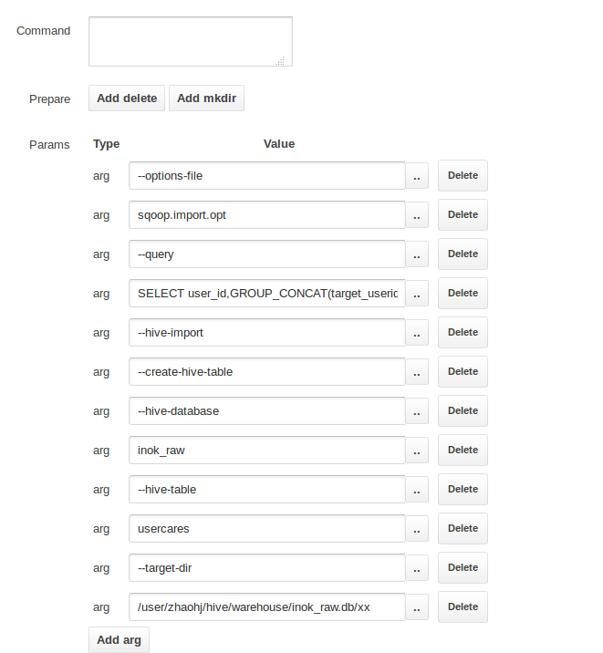

# **Hadoop**

## 1、hue下 sqoop使用query报错

最近因工作需求，需要用hue编排任务，利用sqoop导入数据。导入脚本语句如下

```cmd
sqoop import --connect jdbc:oracle:thin:@ip:port/db --username user --password pwd --query "select col1,col2 from db.table where \$CONDITIONS" --target-dir /user/kjxydata/src/LT_READER_${date_time} --delete-target-dir -m 1 --null-string '\\N' --null-non-string '\\N' --as-textfile --fields-terminated-by "\t" --hive-drop-import-delims
```

但运行时错误。

在用hue写sqoop导入语句时，有几个坑。

+ 1、在command窗口中不要加 sqoop，直接从import开始。

+ 2、command窗口中使用query是有问题的。对于query后的sql，由于hue调用oozie，oozie在解析命令时会将sql拆解成多个参数，而不是当成一个参数，导致运行时会无法解析命令。

针对第二个问题，目前茶到两种解决方案：

+ 1、直接在hue中利用ssh运行脚本
+ 2、空出command命令框，而在参数框中打入命令

为保持所有sqoop形式命令一致，个人采用第二种方式。具体解决如图：



，注意将query语句写在一个arg中。

另外还有一点，注意`select col1,col2 from db.table where \$CONDITIONS`，在sqoop中如果用了query需要加`where $CONDITIONS`，如果是脚本中用记得加`\`，但是在参数窗口中不要加`\`。

详情还可以参考这个[cloudera的提问](https://issues.cloudera.org/browse/HUE-6717)。xml以后的内容就比较明晰了。


## 2、利用sqoop导入导出时分隔符问题

在导入时利用如下sqoop1导入

```shell
sqoop import --connect jdbc:oracle:thin:@ip:port/ORCL --username user --password pwd --table db.table --target-dir /path --delete-target-dir -m 1 --null-string "\\N" --null-non-string "\\N" --as-textfile --fields-terminated-by "\t" --hive-drop-import-delims
```

但是在导出时使用如下

```shell
sqoop export --connect jdbc:mysql://ip:3306/db?characterEncoding=utf8 --username user --password pwd --table table --export-dir /path* --update-mode allowinsert --update-key id --input-null-string "\\N" --input-null-non-string "\\N" --fields-terminated-by "\t"
```

会经常报错。

排查后发现由于导入时分割符指定为"\t"，部分列中含有字符"\t"，导致导出时分割行出现问题。而后续的`--hive-drop-import-delims`貌似只能替换hive默认的分隔字符。所以建议导入时使用hive默认的分隔符，并带上`--hive-drop-import-delims`，以避免导出时出现问题。

如下：

导入

```shell
sqoop import --connect jdbc:oracle:thin:@ip:port/ORCL --username user --password pwd --table db.table --target-dir /path --delete-target-dir -m 1 --null-string "\\N" --null-non-string "\\N" --as-textfile --fields-terminated-by "\001" --hive-drop-import-delims 
```

导出

```shell
sqoop export --connect jdbc:mysql://ip:3306/db?characterEncoding=utf8 --username user --password pwd --table table --export-dir /path* --update-mode allowinsert --update-key id --input-null-string "\\N" --input-null-non-string "\\N" --fields-terminated-by "\001"
```

**NOTE:**

| 分隔符                                                       | 描述                                                         |
| ------------------------------------------------------------ | ------------------------------------------------------------ |
| \n                                                           | 对于文本文件来说，每行都是一条记录，因此换行符可以分隔记录   |
| ^A(ctl+A)                                                    | 用于分隔字段(列)。在CREATE TABLE语句中可以使用八进制编码\001表示 |
| ^B(ctl+B)                                                    | 用于分隔ARRAY或者STRUCT中的元素，或用于MAP中键-值对之间的分隔。在CREATE TABLE语句中可以使用八进制编码\002表示 |
| ^C(ctl+C)                                                    | 用于MAP中键和值之间的分隔。在CREATE TABLE语句中可以使用八进制编码\003表示 |

 Hive 中没有定义专门的数据格式，数据格式可以由用户指定，用户定义数据格式需要指定三个属性：列分隔符（通常为空格、”\t”、”\001″）、行分隔符（”\n”）以及读取文件数据的方法。由于在加载数据的过程中，不需要从用户数据格式到 Hive 定义的数据格式的转换，因此，Hive 在加载的过程中不会对数据本身进行任何修改，而只是将数据内容复制或者移动到相应的 HDFS 目录中。

**建议**

最好使用”\001″作为列分隔符，"\t"在文本中极容易出现，导致导出时错误。